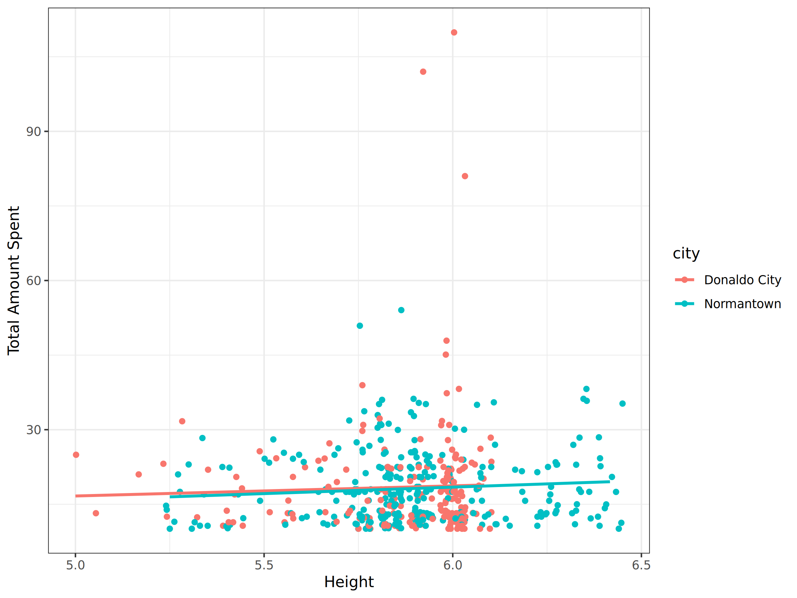
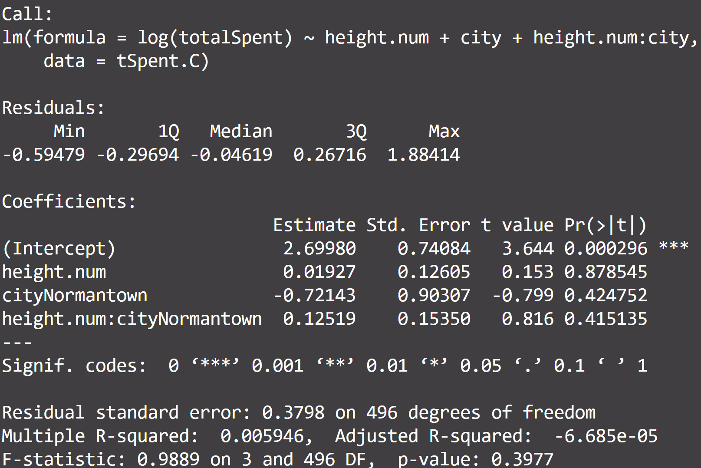

import OutputDisplay from '../../components/OutputDisplay.astro'

In this post, we'll dive into a practical data analysis process using R, focusing on customer and order data from Chipotle Mexican Grill. As one of the leading fast-casual restaurant chains, Chipotle's data can provide valuable insights into customer behavior and preferences in the food industry. We'll walk through various analyses, from data cleaning to visualization, demonstrating how these techniques can be applied to real-world business questions.

Before we begin, you can access the raw data used in this analysis here:

- [Chipotle Customer Data](https://raw.githubusercontent.com/towardsuffering/data/main/customers.csv)
- [Chipotle Order Data](https://raw.githubusercontent.com/towardsuffering/data/main/orders.csv)

Feel free to download these datasets if you'd like to follow along with the analysis on your own machine.

## Setting Up the Environment

First, let's load our Chipotle data and required packages:

```r
# Load data
C <- read.csv("https://raw.githubusercontent.com/towardsuffering/data/main/customers.csv", fileEncoding = 'UTF-8-BOM')
O <- read.csv("https://raw.githubusercontent.com/towardsuffering/data/main/orders.csv",  fileEncoding = 'UTF-8-BOM')

# Load packages
require(ggplot2)
```

## Part 1: Analyzing Chipotle Order Data

Our first task is to calculate the total amount spent by each Chipotle customer. This can help identify high-value customers and inform loyalty programs.

### Cleaning Price Data

We need to remove the dollar sign from the price data and convert it to numeric:

```r
# Remove "$" and convert to numeric
O$item_price.num <- as.numeric(sub(O$item_price, pattern="$", replacement="", fixed=TRUE))

# Calculate total spent per customer
tSpent <- aggregate(item_price.num ~ cust_id, FUN=sum, data=O)

# Rename the column for clarity
names(tSpent)[names(tSpent) == "item_price.num"] <- "totalSpent"

print(head(tSpent))
```

<OutputDisplay>
	cust_id totalSpent 1 1 24.93 2 2 16.98 3 3 12.67 4 4 21.00 5 5 13.70 6 6 17.50
</OutputDisplay>

This analysis helps Chipotle understand customer spending patterns, which can inform pricing strategies and menu design.

## Part 2: Analyzing Chipotle Customer Data

Next, we'll look at customer heights. While height might seem unrelated to food preferences, physical characteristics can sometimes correlate with dietary choices or portion sizes.

### Converting Height to Decimal Format

We'll convert height from a string format (e.g., "6ft 0in") to a decimal:

```r
C$height.num <- rep(NA)

for (i in 1:nrow(C)) {
    feet.part <- sub(C$height[i], pattern="ft.*", replacement="", fixed=FALSE)
    inch.part.temp <- sub(C$height[i], pattern=".ft ", replacement="", fixed=FALSE)
    inch.part <- sub(inch.part.temp, pattern="in", replacement="", fixed=FALSE)
    C$height.num[i] <- as.numeric(feet.part) + as.numeric(inch.part) / 12
}

print(head(C$height.num))
```

<OutputDisplay>[1] 6.000000 5.916667 6.000000 5.166667 6.333333 5.750000</OutputDisplay>

### Calculating Average Height by City

Let's find the average height of Chipotle customers in each city:

```r
avg_heights <- aggregate(height.num ~ city, FUN=mean, data=C)
print(avg_heights)
```

<OutputDisplay>city height.num 1 Donaldo City 5.912281 2 Normantown 5.948276</OutputDisplay>

This information could be useful for Chipotle in designing restaurant layouts or adjusting portion sizes based on regional differences.

## Part 3: Analyzing Relationship Between Height and Spending at Chipotle

Now, let's explore if there's a relationship between customer height and their spending at Chipotle. We'll use a statistical technique called linear regression to investigate this relationship.

### What is Linear Regression?

For beginners: Linear regression is a statistical method used to understand the relationship between two variables. It's like drawing a "best fit" line through a scatter plot of data points. This line helps us predict one variable (in this case, spending) based on another variable (height).

For experts: Linear regression models the relationship between a dependent variable (Y) and one or more independent variables (X) by fitting a linear equation to the observed data. The method minimizes the sum of squared vertical distances between the observed responses in the dataset and the responses predicted by the linear approximation.

### Preparing the Data

First, we need to combine our spending data with our customer data:

```r
# Merge spending data with customer data
tSpent.C <- merge(x=tSpent, y=C, by="cust_id")
```

This step creates a new dataset `tSpent.C` that includes both the total amount spent by each customer and their height.

### Visualizing the Relationship

Before we run our regression, let's visualize the data:

```r
# Create a scatterplot
ggplot(data=tSpent.C, aes(x=height.num, y=totalSpent, color=city)) +
    geom_jitter() +
    geom_smooth(method=lm, se=FALSE) +
    xlab("Height (in feet)") +
    ylab("Total Amount Spent ($)") +
    theme_bw()
```



This scatter plot shows:

- Each point represents a customer
- The x-axis shows height in feet
- The y-axis shows total amount spent in dollars
- Colors represent different cities
- The lines represent the linear regression for each city

For beginners: This plot helps us visually see if there's a pattern between height and spending. If the points tend to go up as we move from left to right, it might suggest that taller people spend more.

For experts: The `geom_jitter()` function adds a small amount of random noise to the points, helping to visualize overlapping data points. The `geom_smooth(method=lm)` adds a linear regression line for each city.

### Running the Linear Regression

Now, let's perform the linear regression:

```r
# Run a regression
lMod <- lm(totalSpent ~ height.num + city, data=tSpent.C)
summary(lMod)
```



Let's break down this output:

For beginners:

1. We're now looking at how height and city affect the log of total spending. Using log(totalSpent) helps us handle large variations in spending more effectively.
2. The 'Estimate' column shows how each variable affects log(spending):
   - For every 1 foot increase in height, log(spending) increases by about 0.01927 in Donaldo City
   - Being in Normantown is associated with a decrease in log(spending) by about 0.72143
   - The interaction term (height.num:cityNormantown) shows how the effect of height differs in Normantown
3. The stars (\*\*\*) next to the Intercept indicate we're very confident that the starting point of our model (when height is 0) is not just due to chance.
4. However, none of the other variables have stars, suggesting we're less certain about their effects.

For experts:

1. The model uses log(totalSpent) as the dependent variable, which can be interpreted as percentage changes in spending for unit changes in the independent variables.
2. The intercept (2.69980) is statistically significant (p < 0.001), representing the log of expected spending for a person of zero height in Donaldo City (not meaningful in practice, but important for the model).
3. Neither the main effects (height.num and cityNormantown) nor the interaction term are statistically significant at the 0.05 level.
4. The coefficient for height.num (0.01927) suggests that in Donaldo City, a one-foot increase in height is associated with approximately a 1.93% increase in spending (e^0.01927 ≈ 1.0193), but this is not statistically significant (p = 0.878545).
5. The interaction term (0.12519) suggests that the effect of height on spending might be different in Normantown, but this difference is also not statistically significant (p = 0.415135).
6. The model's fit is very poor (R² = 0.005946), indicating that these variables explain only about 0.6% of the variance in log(spending).
7. The overall F-statistic (0.9889) and its p-value (0.3977) suggest that the model as a whole is not statistically significant.

### Interpreting the Results

For beginners: Our more complex analysis suggests that the relationship between height, city, and spending at Chipotle is not as clear or strong as we might have thought. While there might be small differences in how height affects spending in different cities, we can't be very confident that these differences are real and not just due to chance.

For experts: This log-transformed model with an interaction term fails to provide evidence of a significant relationship between height, city, and spending at Chipotle. The extremely low R² and non-significant F-statistic suggest that these variables have very little explanatory power for the variation in customer spending.

### Limitations and Next Steps

1. **Lack of significant predictors**: None of our variables (height, city, or their interaction) showed a statistically significant relationship with spending. This suggests we may need to consider other factors that might influence customer spending.

2. **Very low R-squared**: Our model explains only about 0.6% of the variance in log(spending), indicating that other unobserved variables likely play a much more important role in determining customer spending.

3. **Potential non-linear relationships**: We've assumed a linear relationship (in the log-transformed space) between height and spending. It might be worth exploring non-linear relationships or other transformations of our variables.

4. **Limited variables**: We've only considered height and city. Including other variables like age, frequency of visits, or menu preferences could potentially improve our model.

5. **Assumptions**: As with any linear regression, we should check the assumptions of linearity, independence, homoscedasticity, and normality of residuals. Given the poor fit of the model, some of these assumptions may be violated.

6. **Data quality**: It might be worth revisiting our data collection and cleaning processes to ensure there are no issues with data quality that could be affecting our results.

Next steps could include:

- Exploring other potential predictors of spending
- Considering non-linear modeling techniques (e.g., generalized additive models)
- Conducting a more thorough exploratory data analysis to identify potential patterns or relationships we might have missed
- Collecting additional data that might be more relevant to predicting customer spending

In conclusion, while our analysis didn't reveal strong relationships between height, city, and spending at Chipotle, the process of conducting this analysis and interpreting the results is valuable. It demonstrates the importance of thorough statistical analysis and the need to consider multiple factors when trying to understand customer behavior.
